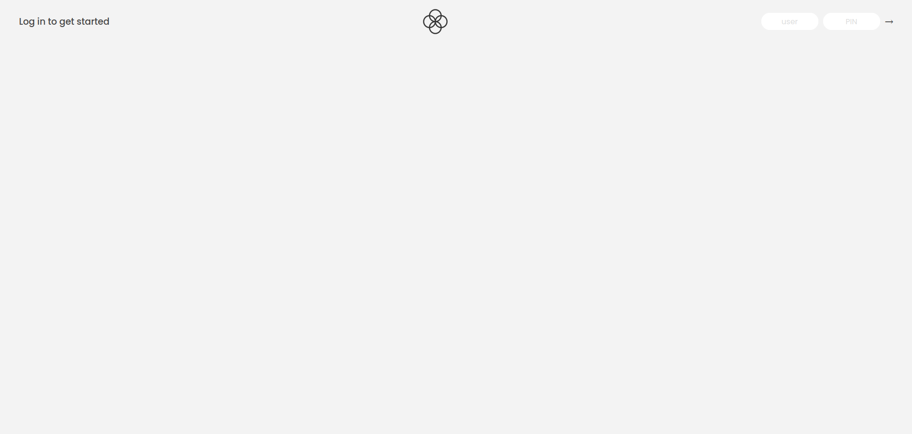
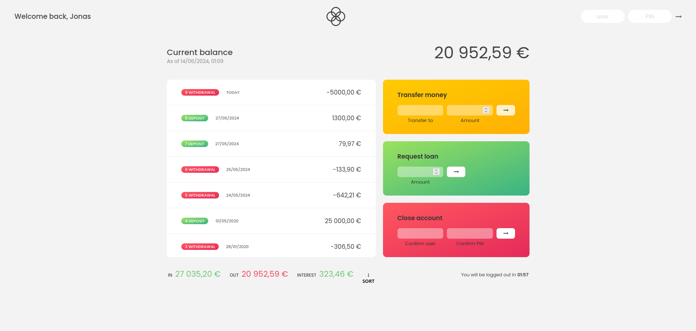
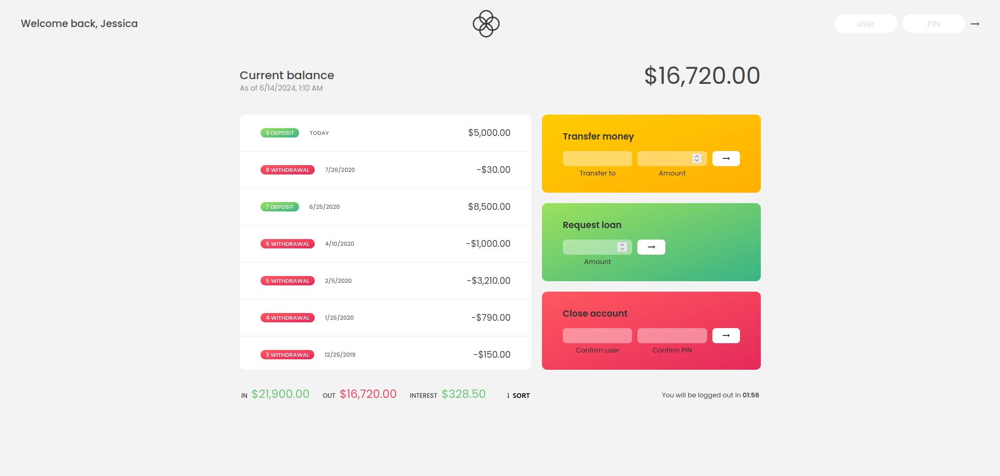

# Bankist
Project in JavaScript from Jonas Schmedtmann Javascript course on Udemy. The HTML and CSS files are already provided in order to focus only on Javascript.

# Aim of the project
The goal here is to simulate a bank app in which clients can transfer money and request a loan.
Closing account is also possible. If no actions is made in time lapse of two minutes, the user will be automatically loged out.

# Log in page

# Account page
Here we simulate a transfer money. Jonas would like to transfer 5000€ to Jessica.

# Sender new current balance
If the sender's funds allows them to make a money tranfer, we will then see the new current balance.

# Recipient new current balance
Fianlly we can see the recipient's new current balance 

